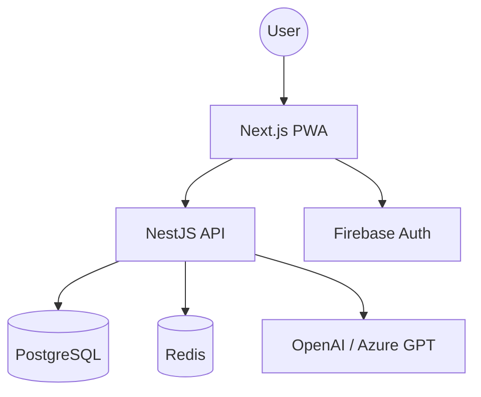

# Yumna - Asisten Keuangan Keluarga Islami

Yumna adalah asisten AI yang terintegrasi dalam aplikasi pengatur keuangan keluarga berbasis nilai-nilai Islami.

## Arsitektur Sistem

## Teknologi Utama
- **Frontend:** Next.js, Tailwind CSS, Radix UI, Framer Motion
- **Backend:** NestJS, Prisma (PostgreSQL), Redis
- **AI:** OpenAI GPT-4o
- **Auth:** NEXT Auth

## Struktur Proyek
- `/frontend`: Aplikasi web (Next.js)
- `/backend`: API Server (NestJS)
- `/Doc`: Dokumentasi proyek

## Cara Menjalankan
1. Pastikan Docker sudah terpasang.
2. Jalankan `docker-compose up -d` untuk database dan redis.
3. Masuk ke folder `frontend` dan `backend`, salin `.env.example` ke `.env` dan sesuaikan.
4. Jalankan `npm install` dan `npm run dev` di masing-masing folder.
